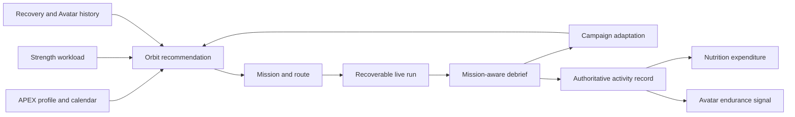

# APEX Orbit architecture

APEX Orbit is the fifth APEX portal. It is not a separate project and does not own a second profile, nutrition model, strength calendar or Avatar. It reads those existing domains and writes one authoritative running record back into them.

## Layers

1. `src/orbit/domain` is portable TypeScript. GPS filtering, splits, route comparison, mission selection, induction, campaign generation, adaptation, GPX and poster metadata do not import React, Leaflet or browser APIs.
2. `src/orbit/platform` contains replaceable web adapters. The current adapters use browser Geolocation, OpenStreetMap, Nominatim and BRouter. The interfaces in `ports.ts` are the seam for a future Swift/Core Location/MapKit implementation.
3. `src/orbit/data` is private, user-indexed IndexedDB storage plus an idempotent outbox. Finishing a run stores the completed run, removes the active run and queues the remote write in one transaction.
4. `src/orbit/store` merges local and Supabase state and refuses writes whose `user_id` differs from the active profile.
5. `src/orbit/pages` contains the product experience. Every screen is route-level lazy loaded. Leaflet is a second lazy chunk, so the APEX portal does not parse map code.

## Connected flow

## Honest sensor model

- Invalid coordinates, weak-accuracy samples, impossible jumps and false speed spikes are rejected before metrics are calculated.
- Distance is a filtered geodesic sum. Moving time uses a defensible movement threshold and ignores long sample gaps. Splits are interpolated at kilometre boundaries.
- Elevation is shown only when usable altitude samples exist. Heart rate and cadence are shown only when actually recorded.
- Calories use the running distance rule with the logged-in profile's current weight. The resulting Orbit activity replaces overlapping manual run or watch entries instead of being added to them.
- The web build cannot guarantee continuous geolocation after iOS or Android suspends a locked browser tab. The active run remains recoverable, but reliable locked-screen recording requires the future native adapter.

## Route and live-run state

A route is optional. Planned runs hold the complete private route geometry; free runs start without one. Active run state is updated in IndexedDB during recording. A page crash, accidental navigation or reload restores the same run for that user. Finish is idempotent through a deterministic client key.

Route generation returns three directional alternatives, scores them against the mission and desired terrain, and compares candidate geometry against that user's saved routes for familiarity. If the remote provider is unavailable, drawing, GPX import and free running remain available.

## Cross-domain rules

- A completed Orbit run is authoritative for that date. Overlapping `jog-run` and watch-calorie entries are removed; unrelated work and life activity blocks remain.
- Nutrition changes are proposals with exact calorie and macro deltas. Nothing is applied silently.
- High-cost runs produce a reversible strength-coordination proposal and can reduce the next demanding campaign session.
- Campaign generation reads the existing Main Phase lower-body weekdays. User-owned travel and filming events can move a demanding run while retaining `prescribed_date`, the original prescription and an explicit adaptation reason.
- The Avatar receives one imported endurance activity, not individual GPS points, preventing double counting.

## Performance characteristics

- Orbit screens are independent Vite chunks.
- Leaflet CSS and JavaScript load only on a map screen.
- Star fields are procedural CSS with no raster download and no continuous mobile animation.
- GPS calculations are linear in sample count. Long tracks are simplified before route posters and route persistence can later be compacted further without changing the domain API.
